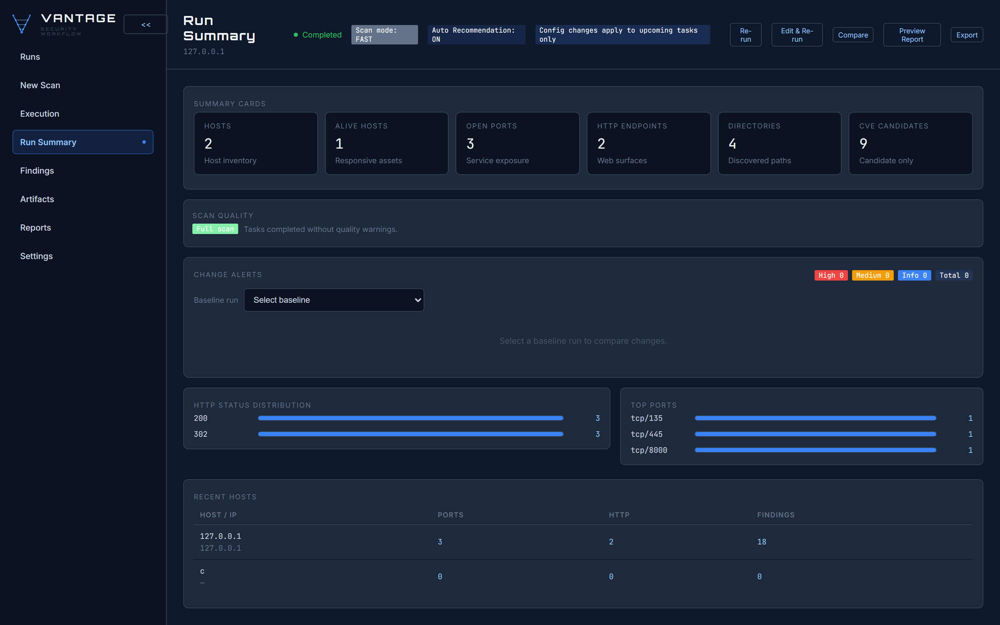
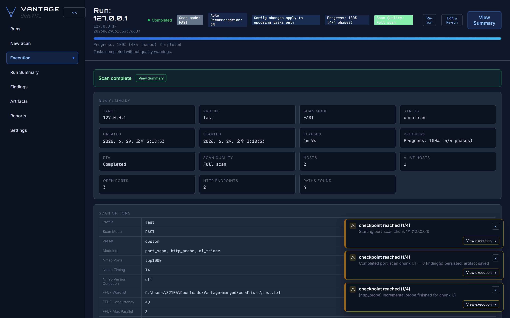
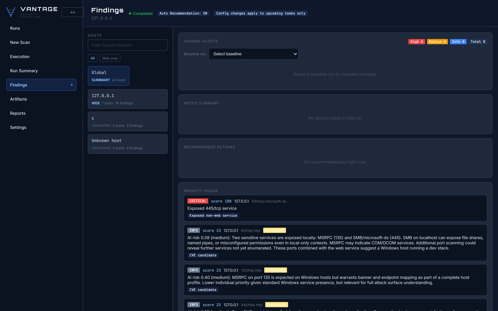
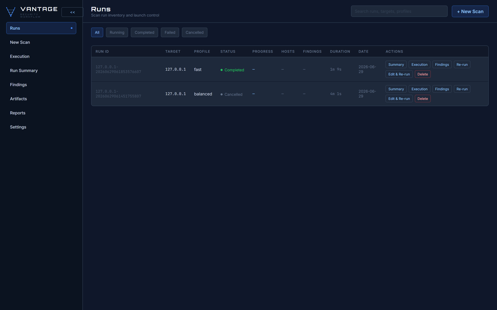
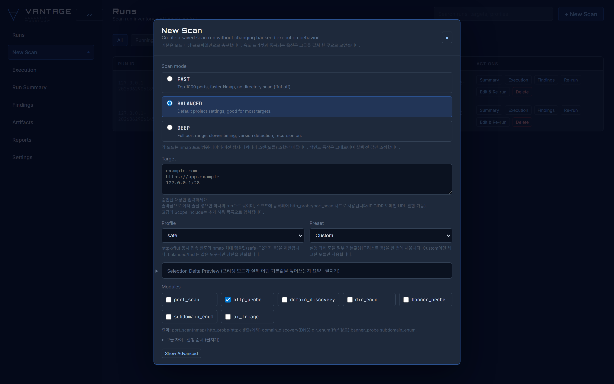
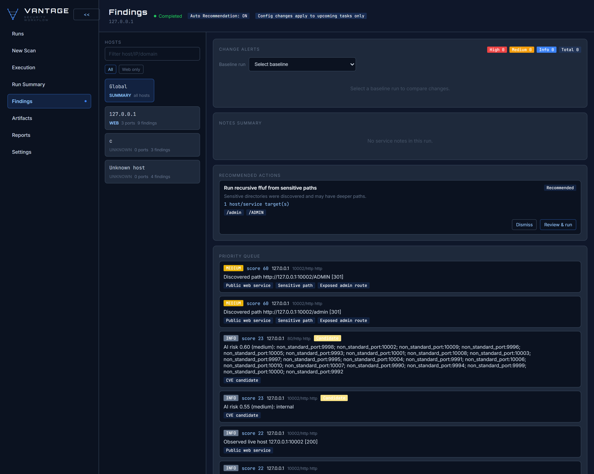

# Vantage-AI

**A resumable reconnaissance & web-assessment orchestrator for *authorized* targets — fully useful on its own, with an *optional* LLM analyst.**

Vantage-AI wraps battle-tested external tools (subfinder, httpx, ffuf, nmap, masscan, naabu, dnsx, …), normalizes everything into a single evidence-driven `Finding` model, persists resumable state in SQLite, chains discovery automatically (subdomains → live hosts → **hidden ports → their hidden directories**), and reports it all through a CLI and a local web UI.

> ✅ **No LLM required.** The entire scanning pipeline — discovery, probing, directory enumeration, port scanning, candidate-CVE matching, resumable state, and reporting — runs with **zero API keys and no AI**. It's a complete, manual-driven scanner out of the box. The `ai_triage` phase is a **purely optional** layer you opt into (and even then it falls back to a deterministic heuristic when no key is set). See [Works with or without an LLM](#works-with-or-without-an-llm).

> ⚠️ **Authorized defensive use only.** No exploit delivery, no credential attacks, no stealth/evasion/persistence. CVE matches are *candidate-only* leads for manual verification, never confirmed vulnerabilities. Only scan assets you own or are explicitly authorized to test.

---

## Table of Contents

- [Screenshots](#screenshots)
- [Why Vantage-AI](#why-vantage-ai)
- [Works with or without an LLM](#works-with-or-without-an-llm)
- [Architecture](#architecture)
- [Capabilities (scan phases)](#capabilities-scan-phases)
- [Finding hidden ports & their hidden directories](#finding-hidden-ports--their-hidden-directories)
- [The `ai_triage` phase (LLM-in-the-loop)](#the-ai_triage-phase-llm-in-the-loop)
- [Requirements](#requirements)
- [Installation](#installation)
- [Quick start](#quick-start)
- [CLI reference](#cli-reference)
- [Running scans end-to-end](#running-scans-end-to-end)
- [AI configuration](#ai-configuration)
- [Outputs & findings](#outputs--findings)
- [Safety model](#safety-model)
- [Development](#development)
- [Disclaimer](#disclaimer)

---

## Screenshots

> Captured from real, authorized runs against `127.0.0.1` (the local UI host).

**Run summary (core — no LLM).** Evidence-driven cards (hosts, open ports, HTTP endpoints, directories, candidate CVEs), HTTP status distribution, and top ports — the standard output of a manual scan.



**Execution (core — no LLM).** The resumable, multi-pass execution loop with live checkpoints and 100% completion. (When the optional `ai_triage` phase is enabled it also enqueues deeper scans here, but the loop itself is LLM-free.)



**Findings.** Normalized, prioritized findings. The natural-language risk rationale shown here comes from the **optional** `ai_triage` phase — without it you get the same evidence, tags, and priority queue to triage manually.



<details>
<summary>More: dashboard & new-scan</summary>

**Dashboard** — run inventory and launch control:



**New Scan** — scan mode, target, and modules (`ai_triage` is one optional module among the standard recon phases):



</details>

---

## Why Vantage-AI

Most recon tooling either runs a fixed pipeline or dumps raw tool output and leaves prioritization to you. Vantage-AI is built to be a strong **manual-driven** scanner first:

- **Orchestration, not reinvention** — it drives proven tools and focuses on state, normalization, resumability, and reporting.
- **Resumable by design** — every task lives in SQLite; interrupt and continue without losing findings or artifacts.
- **Evidence-driven** — all results normalize into one `Finding` model, separated into hosts / subdomains / paths / ports / candidate-CVEs.
- **Automatic discovery chaining** — subdomains → live hosts → **hidden ports → their hidden directories**, with incremental follow-up scans enqueued as new evidence arrives — no AI needed.
- **Operator-friendly** — CLI + local web UI, speed profiles, CIDR chunking, a stall-detection watchdog, and an external-tool installer.
- **Optional AI analyst** — *if* you enable it, an LLM ranks the attack surface by risk and can autonomously queue deeper safe scans. Strictly additive: everything above works without it.

---

## Works with or without an LLM

Vantage-AI is designed so the **LLM is a bonus, not a dependency**.

| | Without any LLM (default) | With the optional `ai_triage` phase |
|---|---|---|
| Discovery → probe → dir_enum → port scan | ✅ full pipeline | ✅ same |
| Hidden-port → hidden-directory chaining | ✅ automatic | ✅ same |
| Candidate-CVE matching | ✅ offline signature engine | ✅ same |
| Resumable state, CLI, web UI, reports | ✅ | ✅ |
| Risk scoring / prioritization | manual (you triage the evidence) | model- or heuristic-scored, prioritized queue |
| Autonomous "dig deeper on risky hosts" | — (you decide and `extend`) | opt-in `act` mode |

Two things to note:

1. **The `ai_triage` phase is opt-in.** Default scans never include it — it only runs if you select the `ai_triage` module (or the `ai` preset). Every other phase is fully manual/deterministic.
2. **Even when enabled, no API key is required.** With no key, `ai_triage` uses a deterministic keyword/port heuristic (same output shape), so it still works offline and in CI. Set `ANTHROPIC_API_KEY` (or `OPENAI_API_KEY`) only if you want model-quality reasoning.

If you never touch the AI features, Vantage-AI is simply a fast, resumable, evidence-driven recon orchestrator.

---

## Architecture

```
scanner/
├── adapters/       External-tool wrappers (subfinder, assetfinder, crt.sh, securitytrails,
│                   httpx, ffuf, nmap, masscan, naabu, dnsx, gau, subzy, udp, playwright, wappalyzer)
├── normalizers/    Tool output → unified Finding model (subdomain, dirscan, portscan, cve, headers)
├── execution/      Per-phase logic (http_probe, dir_enum, port_scan, banner_probe, cve_match,
│                   access_control, waf_signatures, ai_triage, …)
├── ai/             LLM-in-the-loop triage: client (Anthropic/OpenAI), analyst, planner, schemas
├── ser/            Authenticated-session assessment (authorized use only; redaction + scope guard)
├── storage.py      SQLite persistence (runs, tasks, findings, artifacts)
├── state.py        Run/task state transitions
├── runner.py       Orchestration, CIDR chunking, resume, incremental enqueueing
├── report.py       JSON + HTML reports
├── web.py          Local web UI (run creation, execution control, progress, partial results)
├── installer.py    External-tool installer (go install / brew / winget / choco)
└── watchdog.py     OS-aware stall detection + auto-throttle
```

**Design rules:** adapters / normalization / storage / runner / reporting stay separate; typed Pydantic models everywhere; every phase is independently resumable; deterministic logic preferred over heuristic guesses.

---

## Capabilities (scan phases)

| Phase | Tool(s) | What it does |
|---|---|---|
| `subdomain_enum` | subfinder, assetfinder, crt.sh, securitytrails, dnsx | Subdomain discovery (free-tool-first) + DNS resolution / wildcard handling |
| `http_probe` | httpx | Reachability, titles, tech stack, basic HTTP evidence |
| `domain_discovery` | orchestrator | Derive/confirm in-scope root domains from observed evidence |
| `dir_enum` | ffuf | Directory/content enumeration on live HTTP targets (recursion-aware) |
| `port_scan` | nmap, masscan, naabu | TCP port & service detection; mass pre-scan + targeted NSE |
| `banner_probe` | orchestrator | Service banner collection for triage |
| `cve_match` | offline matcher | **Candidate-only** CVE inference from observed product/version/banner evidence |
| `access_control` | internal | Safe access-control / authorization observation checks |
| `ai_triage` *(optional)* | LLM analyst *(or offline heuristic)* | Opt-in. Risk-scores findings and, in `act` mode, autonomously enqueues deeper scope-locked scans |

Supporting capabilities: WAF signature detection, GAU URL harvesting, subdomain-takeover checks (subzy), UDP scanning, and JS/SPA rendering (playwright) where enabled.

---

## Finding hidden ports & their hidden directories

A core focus of Vantage-AI is uncovering services that hide on **non-standard ports** and the **sensitive directories** behind them — e.g. an admin panel on `:10002`. **This is a fully deterministic capability — no LLM involved.** The chain is automatic:

```
port_scan (full range) → http_probe (every open port) → dir_enum (ffuf)
   finds :10002             confirms HTTP on :10002        finds /admin
```

The key is `http_probe_all_open_ports`: instead of only probing well-known web ports, http_probe attempts HTTP on **every** open port discovered by port_scan. httpx only records a hit when a port actually answers HTTP, so non-web ports (22, 445, …) produce no false positives — but a hidden web service on `:10002` is found and handed to `dir_enum`, which then enumerates its directories. (The optional `ai_triage` phase additionally prioritizes non-standard/high ports, but the discovery itself needs no AI.)

This is enabled by default in **`deep` scan mode** and the **`full`** / **`ai`** presets. To turn it on explicitly (LLM-free):

```bash
python -m scanner.cli scan 10.0.0.5 \
  -m port_scan -m http_probe -m dir_enum
# then set nmap_ports to a full range and http_probe_all_open_ports=true
# (deep mode / full preset set both for you)
```

### Worked example: `/admin` on `:10002`

Real run against an authorized local target with a service hidden on port `10002`. Vantage-AI discovered the port, probed HTTP on it, and `dir_enum` found `/admin` — surfaced as **"Exposed admin route"** with a recursive-enumeration recommendation. (This screenshot happens to show the optional AI phase enabled too, but the port→directory discovery is entirely deterministic.)



> `Observed live host 127.0.0.1:10002 [200]` → `Discovered path http://127.0.0.1:10002/admin [301]` → flagged *Exposed admin route*.

---

## The `ai_triage` phase (LLM-in-the-loop)

> **Optional & opt-in.** Everything above works without this phase. Skip this section entirely if you only want the manual scanner. It runs only when you select the `ai_triage` module or the `ai` preset, and it works with no API key (deterministic heuristic fallback).

When enabled, the `ai_triage` phase adds a triage/prioritization layer on top of recon. After recon, it:

1. **Summarizes evidence** — builds a compact, redacted view of subdomains, live hosts, open ports, directory hits, and candidate CVEs.
2. **Risk-scores targets** — an LLM ranks hosts/subdomains/URLs by how much they warrant deeper (still safe) enumeration, with a rationale and signal list per target. Persisted as `candidate`-only findings tagged `ai`, `risk:high|medium|low`.
3. **Acts autonomously** (in `act` mode) — converts the highest-risk targets into follow-up `http_probe` / `dir_enum` / `port_scan` tasks, **only within authorized scope**, then **re-queues itself** to react to the new findings — a bounded agentic loop.

**Safety is enforced by construction:**

- Acts **only on targets already observed** by recon, and **only within the authorized scope** (subdomains of the run target / IPs in range). It never invents new targets.
- Can only trigger **existing safe enumeration phases**. No exploit delivery, no credential attacks, no evasion.
- **Bounded** by `ai_max_followups` (total deeper scans), `ai_max_iterations` (re-triage passes), and gated by `ai_min_risk_to_act`.

**Provider-agnostic & offline-safe:**

- `ai_provider` = `anthropic` (default) or `openai`; the API key is read from the env var named by `ai_api_key_env` (`ANTHROPIC_API_KEY` by default). Calls go over the existing `httpx` dependency — no extra SDK.
- **No key? It still runs**, using a deterministic keyword/port heuristic. Same output shape, so CI and air-gapped runs work.

---

## Requirements

- **Python 3.12+**
- External tools on `PATH` (install what you need for the phases you run): `subfinder`, `assetfinder`, `httpx`, `ffuf`, `nmap`; optionally `masscan`, `naabu`, `dnsx`, `gau`, `subzy`. `crt.sh` is reached over the network.
- A local wordlist for `ffuf` if running `dir_enum` (SecLists is **not** committed — see [Wordlists](#wordlists)).
- *(Optional)* An LLM API key for `ai_triage` to use a model instead of the offline heuristic.

Check what's installed:

```bash
python -m scanner.cli tools-check
# or install missing Go/native tools:
python -m scanner.cli tools-install
```

---

## Installation

```bash
git clone https://github.com/dpfkdlemtp/Vantage-AI.git
cd Vantage-AI
python3.12 -m venv .venv
source .venv/bin/activate          # Windows: .venv\Scripts\activate
pip install -e '.[dev]'
```

### Environment variables

The project does not auto-load `.env`. Export values in your shell:

```bash
cp .env.example .env
# edit .env, then:
set -a; source .env; set +a
```

No env vars are required for the default passive flow. For LLM-backed `ai_triage`:

```bash
export ANTHROPIC_API_KEY=sk-ant-...     # default provider
# or, for OpenAI: set OPENAI_API_KEY and ai_api_key_env=OPENAI_API_KEY / ai_provider=openai
```

### Wordlists

SecLists (~2 GB) is intentionally **not** committed (see `.gitignore`). Put your own authorized wordlists under `wordlists/`, or drop SecLists there locally. `dir_enum` needs `ffuf_wordlist_path` configured before it runs.

---

## Quick start

**Web UI (recommended):**

```bash
python -m scanner.cli ui            # then open http://127.0.0.1:8000
```

Create a run, pick a preset (`quick` / `web` / `full`), and drive it from the browser — no API key needed.

**CLI — standard scan (no LLM):**

```bash
python -m scanner.cli scan example.com \
  -m subdomain_enum -m http_probe -m dir_enum -m port_scan \
  --profile balanced
```

**CLI — with the optional AI analyst** (only if you want it; add the `ai_triage` module or use the `ai` preset):

```bash
python -m scanner.cli scan example.com \
  -m subdomain_enum -m http_probe -m dir_enum -m port_scan -m ai_triage \
  --profile balanced
```

> `scan` creates and enqueues the run; it does **not** execute scanners itself. Execute phases via the Web UI, or the phase runners (below).

---

## CLI reference

| Command | Purpose |
|---|---|
| `scan TARGET [-m MODULE ...] [--profile safe\|balanced\|fast]` | Create a run and enqueue tasks |
| `resume RUN_ID` | Show resumable (incomplete) tasks for a run |
| `extend RUN_ID -m MODULE ...` | Add phases to an existing run, preserving saved results |
| `report RUN_ID [--html PATH]` | Print JSON summary; optionally write HTML |
| `ui [--host H] [--port P] [--workspace DIR]` | Start the local web UI |
| `tools-check` / `tools-install` | Inspect / install external tool dependencies |
| `watchdog-start` / `watchdog-stop` / `watchdog-status` / `watchdog-tail` | OS-aware stall detection & auto-throttle |
| `ser ...` | Authenticated-session assessment tools (authorized use only) |

---

## Running scans end-to-end

`scan` only enqueues. To execute phases from the same workspace where the run was created:

```bash
python - <<'PY'
from scanner.runner import (
    execute_subdomain_enum_tasks, execute_http_probe_tasks, execute_dir_enum_tasks,
    execute_port_scan_tasks, execute_banner_probe_tasks, execute_cve_match_tasks,
    execute_ai_triage_tasks,
)
run_id = "REPLACE_WITH_RUN_ID"
print(execute_subdomain_enum_tasks(run_id))
print(execute_http_probe_tasks(run_id))
print(execute_port_scan_tasks(run_id))
print(execute_dir_enum_tasks(run_id))
print(execute_banner_probe_tasks(run_id))
print(execute_ai_triage_tasks(run_id))   # LLM analyst: scores risk + (act mode) queues deeper scans
PY
```

Run phases in order; each is resumable and reads persisted outputs from earlier phases. In the **Web UI**, the execution loop runs multiple passes so AI-enqueued follow-ups (and re-triage) complete within the same run automatically.

---

## AI configuration

`ai_triage` is controlled by these `ScanConfig` fields (set via the `ai` UI preset or run config):

| Field | Default | Meaning |
|---|---|---|
| `ai_triage_enabled` | `true` | Master switch for the phase |
| `ai_autonomy` | `act` | `act` (autonomous deeper scans) · `advise` (record risk findings only) · `off` |
| `ai_provider` | `anthropic` | `anthropic` or `openai` |
| `ai_model` | `""` | Model id; empty → provider default (`claude-sonnet-4-6` / `gpt-4o-mini`) |
| `ai_api_key_env` | `ANTHROPIC_API_KEY` | Env var name to read the key from |
| `ai_min_risk_to_act` | `0.6` | Risk threshold (0–1) to enqueue a follow-up |
| `ai_max_followups` | `8` | Total autonomous follow-up scans per run (budget) |
| `ai_max_iterations` | `3` | Max re-triage passes (loop bound) |
| `ai_request_timeout_seconds` | `60` | Per-request LLM timeout |

**Autonomy modes at a glance:**

- `act` — the headline mode. LLM scores risk and autonomously queues deeper safe scans within scope.
- `advise` — LLM records risk findings; a human decides whether to `extend` the run.
- `off` — phase is a no-op.

---

## Outputs & findings

```
runs/<run_id>/
├── state.db        # SQLite: run state, tasks, findings, artifact references
└── artifacts/      # raw tool outputs (subfinder/httpx/ffuf/nmap/... XML/JSON/logs)
```

- **Artifacts** are stored on disk; SQLite holds metadata (path, sha256, size, content-type) — not raw blobs.
- **Findings** normalize into one model and group in reports as: subdomains · live hosts · directory hits · open ports/services · candidate CVEs · **AI risk findings** (`candidate`-only, tagged `ai`/`risk:*`).
- `report RUN_ID` prints a JSON summary; `--html` also writes a readable HTML report.

---

## Safety model

- Authorized defensive assessment **only**.
- Safe defaults; **no** exploit delivery, credential attacks, stealth, evasion, persistence, or destructive checks.
- CVE matches are **candidate-only** (matched product/version, confidence, evidence source, `candidate_only=true`).
- The AI analyst **cannot widen scope**: it acts only on already-observed targets inside the authorized scope, triggers only safe enumeration phases, and is bounded by explicit budgets.
- Authenticated-session (`ser`) tooling redacts secrets and enforces a scope allowlist.

---

## Development

```bash
python -m pytest          # full test suite
python -m mypy scanner    # type check
python -m ruff check .     # lint
```

The suite mocks subprocess/tool/network calls by default, so it runs without the external binaries or an LLM key.

---

## Disclaimer

This project is for **authorized** security assessment and educational use only. You are responsible for ensuring you have explicit permission to scan any target. The authors assume no liability for misuse. Candidate CVEs and AI risk scores are **leads for manual verification**, not confirmed findings.
